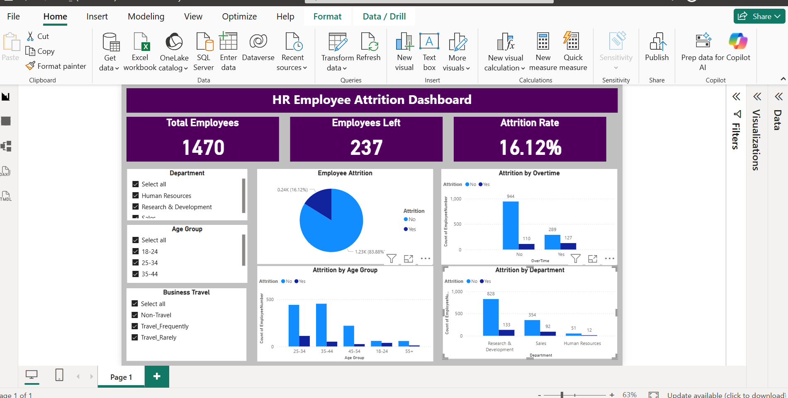

# SkillCraft Technology Internship – Task 3

# Interactive HR Employee Attrition Dashboard using Power BI

## Project Overview

This project was completed as part of my **Data Analytics Internship at SkillCraft Technology**.

The objective of this task was to develop an interactive Power BI dashboard to analyze employee attrition and answer the business question:

**"Why are employees leaving?"**

The dashboard enables users to explore employee turnover through interactive visualizations and filters, helping identify trends and factors contributing to employee attrition.

---

## Objectives

- Analyze employee attrition using HR data.
- Build an interactive dashboard in Power BI.
- Enable filtering by Department, Age Group, Business Travel, and other employee attributes.
- Generate meaningful business insights to support HR decision-making.

---

## Tools & Technologies

- Microsoft Power BI
- DAX (Data Analysis Expressions)
- HR Employee Attrition Dataset
- Data Visualization

---

## Dashboard Features

- KPI Cards
  - Total Employees
  - Employees Left
  - Attrition Rate

- Interactive Slicers
  - Department
  - Age Group
  - Business Travel

- Visualizations
  - Employee Attrition Distribution
  - Attrition by Overtime
  - Attrition by Age Group
  - Attrition by Department

---

## Key Insights

- Employees working overtime showed a higher attrition rate.
- The Research & Development department had the highest number of employees as well as the highest attrition count.
- Employees in the 25–34 and 35–44 age groups experienced higher attrition compared to other age groups.
- Interactive filters allow users to analyze attrition across departments, age groups, and business travel categories.

---

## Repository Contents

- `Task3(Dashboard).pbix` – Power BI project file
- `WA_Fn-UseC_-HR-Employee-Attrition.csv` – Dataset used for analysis
- `Dashboard_Screenshot.png` – Dashboard screenshot
- `README.md` – Project documentation

---

## Dashboard Preview

---

## Outcome

This project strengthened my skills in:

- Power BI Dashboard Development
- Interactive Data Visualization
- DAX Calculations
- HR Analytics
- Business Intelligence
- Data Storytelling

Thank you for visiting this repository! Feel free to explore the dashboard and share your feedback.
